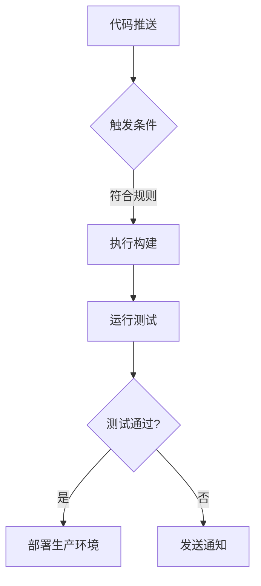

# GitHub Actions 入门指南

<!-- DESC SEP -->

> ✨文章摘要（AI生成）
> GitHub Actions 是 GitHub 提供的自动化工具，允许你在代码仓库中直接创建、测试、部署代码的自动化流程。本指南从基础概念到实战示例，手把手教你配置第一个自动化工作流。
> <!-- DESC SEP -->

## 一、核心概念解析

### 1.1 基础术语

- **Workflow（工作流）** 
  自动化流程的配置文件（YAML 格式），存放在 `.github/workflows` 目录下，每个文件对应一个独立的工作流。

- **Job（作业）** 
  一个工作流由多个作业组成，默认并行执行（可通过 `needs` 关键字配置依赖关系实现串行）。

- **Step（步骤）** 
  每个作业包含多个步骤，按顺序执行。步骤可以是：
  - Shell 命令（`run`）
  - 调用预定义动作（`uses`）
  - 自定义脚本

- **Action（动作）** 
  可复用的代码单元（如检出代码、发送通知），可通过 [GitHub Marketplace](https://github.com/marketplace) 获取现成动作。

### 1.2 文件结构示意

```
你的项目/
├── .github/
│   └── workflows/
│       ├── ci.yml     # 持续集成工作流
│       └── deploy.yml # 部署工作流
└── src/              # 项目源代码
```

---

## 二、创建第一个工作流

### 2.1 配置示例

在项目根目录创建 `.github/workflows/first-workflow.yml`：

```yaml
# 工作流名称（显示在Actions页面）
name: My First Workflow

# 触发条件：当代码推送到任意分支时触发
on: [push]

jobs:
  # 作业ID（自定义名称）
  build-job:
    # 运行环境（可选：ubuntu-latest/windows-latest/macos-latest）
    runs-on: ubuntu-latest
    
    # 步骤集合
    steps:
      # 步骤1：检出代码（必须的第一步）
      - name: Checkout repository
        uses: actions/checkout@v4  # 使用官方提供的代码检出动作

      # 步骤2：自定义命令
      - name: Greeting
        run: |  # 执行多行命令
          echo "🎉 GitHub Actions 已启动！"
          echo "当前时间: $(date)"
```

### 2.2 执行流程说明

1. **推送代码**到 GitHub 仓库
2. 进入仓库的 **Actions** 标签页
3. 选择左侧的 "My First Workflow"
4. 查看实时执行日志（点击具体运行记录）

---

## 三、常用触发机制

### 3.1 事件触发

```yaml
on:
  # 当创建新标签时触发
  create_tag:
  
  # 当合并PR到main分支时触发
  pull_request:
    branches: [main]
  
  # 当issue被关闭时触发
  issues:
    types: [closed]
```

### 3.2 定时触发

```yaml
on:
  schedule:
    # 每天北京时间8点运行（UTC时间0点）
    - cron: '0 0 * * *'
    # 每周一9:30运行
    - cron: '30 9 * * 1'
```

### 3.3 手动触发

```yaml
on:
  workflow_dispatch:
    inputs:
      environment:
        description: '部署环境'
        required: true
        default: 'staging'
```

---

## 四、典型应用场景

### 4.1 Node.js 项目自动化测试

```yaml
jobs:
  test:
    runs-on: ubuntu-latest
    steps:
      - uses: actions/checkout@v4
      
      # 设置Node.js环境
      - name: Setup Node.js
        uses: actions/setup-node@v3
        with:
          node-version: 18  # 指定Node版本
          cache: 'npm'      # 启用依赖缓存
      
      # 安装依赖
      - name: Install dependencies
        run: npm ci        # 使用clean install保证依赖一致性
      
      # 运行测试
      - name: Run tests
        run: npm test
      
      # 生成覆盖率报告
      - name: Generate coverage
        run: npm run coverage
      
      # 上传测试结果
      - uses: actions/upload-artifact@v3
        with:
          name: test-results
          path: |
            test-results/
            coverage/
```

### 4.2 多环境构建部署

```yaml
jobs:
  build:
    runs-on: ubuntu-latest
    outputs:
      build-info: ${{ steps.meta.outputs.result }}
    steps:
      - uses: actions/checkout@v4
      
      - name: Build project
        run: |
          npm install
          npm run build
          
      # 生成构建元数据
      - id: meta
        run: |
          echo "result=build-success-$(date +%s)" >> $GITHUB_OUTPUT
      
      - uses: actions/upload-artifact@v3
        with:
          name: production-build
          path: dist/

  deploy:
    needs: build  # 依赖build作业
    runs-on: ubuntu-latest
    environment: production  # 使用环境保护
    steps:
      - name: Download artifact
        uses: actions/download-artifact@v3
        with:
          name: production-build
          
      - name: Deploy to server
        env:
          SSH_KEY: ${{ secrets.DEPLOY_SSH_KEY }}
        run: |
          scp -i $SSH_KEY -r . user@server:/var/www
```

---

## 五、进阶配置技巧

### 5.1 密钥管理

1. 进入仓库 Settings → Secrets and variables → Actions
2. 点击 "New repository secret"
3. 在workflow中调用：

```yaml
- name: Deploy
  env:
    API_TOKEN: ${{ secrets.API_KEY }}
  run: |
    curl -H "Authorization: Bearer $API_TOKEN" ...
```

### 5.2 矩阵策略（多版本测试）

```yaml
jobs:
  test:
    strategy:
      matrix:
        node-version: [14.x, 16.x, 18.x]
        os: [ubuntu-latest, windows-latest]
    runs-on: ${{ matrix.os }}
    steps:
      - uses: actions/checkout@v4
      - uses: actions/setup-node@v3
        with:
          node-version: ${{ matrix.node-version }}
      - run: npm test
```

### 5.3 工作流可视化



---

## 六、学习资源推荐

1. **官方文档**  
   [GitHub Actions 官方指南](https://docs.github.com/zh/actions) - 最权威的参考资料

2. **实战案例库**  
   [GitHub Actions Examples](https://github.com/actions/examples) - 官方示例仓库

3. **调试工具**  
   [GitHub Actions 调试工具](https://github.com/nektos/act) - 本地运行工作流

4. **安全指南**  
   [安全加固指南](https://securitylab.github.com/tools/actions) - 避免常见安全隐患

5. **阮一峰的网络日志**   
   [阮一峰的网络日志](https://www.ruanyifeng.com/blog/2019/09/getting-started-with-github-actions.html) - 阮一峰的网络日志